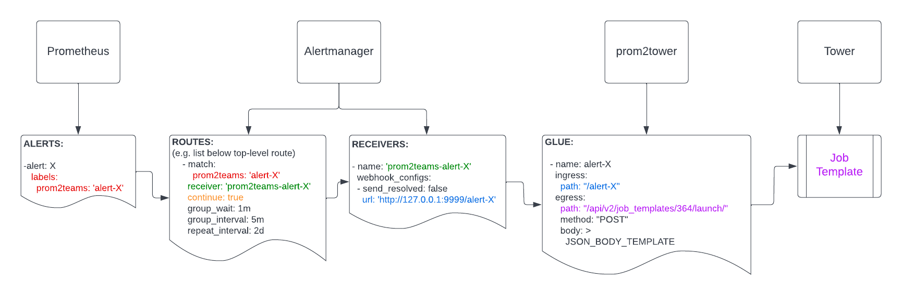

# prometheus2tower

Prometheus2tower is a service that integrates [prometheus-alertmanager](https://prometheus.io/docs/alerting/latest/alertmanager/) and [Ansible Tower](https://docs.ansible.com/ansible-tower/).

Its primary use is to trigger job template runs (e.g. remediation playbooks) when specific alerts are fired, although other use-cases could be thought-out.

It listens on [configured](cmd/prom2tower/conf.yaml.example) endpoints for incoming alerts. Upon receipt, unmarshalls received JSON and can use this data to fill out the template of the configured tower request body.
The request is then sent to the configured tower endpoint to trigger a template run, or, it might be configured to do other [Tower API](https://docs.ansible.com/ansible-tower/latest/html/towerapi/index.html) calls.

Example endpoint configuration:

```
  - name: alertmanager-tower-glue
    ingress:
      path: "/webhook-url-configured-as-alertmanager-receiver"
    egress:
      towerHost: "https://tower.local.lan"
      towerToken: "PasteLocalTokenHere"
      path: "/api/v2/job_templates/364/launch/"
      method: "POST"
      body: >
        { 
          "limit": "{{ range .Alerts }}{{ .Labels.instance }},{{ end }}",
          "verbosity": 3,
          "extra_vars": 
            { 
              "input": "Firing for: {{ range .Alerts }}{{ .Labels.instance }} {{ end }}"
            } 
        }
```

Example end-to-end pipeline setup diagram:




## Usage

### Build


```
# make
...
# tree build/
build/
└── prom2tower-v0.0.1
    ├── conf.yaml.example
    ├── prom2tower
    └── README.md
```

Or download the release zip.

### Prepare and run

Use the example [conf.yaml](cmd/prom2tower/conf.yaml.example) and tailor it to your setup.

Manual run:
```
# prom2tower -c /usr/local/etc/prom2tower.yaml
2022/04/26 22:12:51 WARNING: logFile err not a string, silently proceeding with logfile=stderr
prom2tower:2022/04/26 22:12:51.672649 version.go:11: ----------------------------------------
prom2tower:2022/04/26 22:12:51.672665 version.go:12: Version: v0.0.1
prom2tower:2022/04/26 22:12:51.672668 version.go:13: Build commit hash: 7b4963c2a3d0f4e9800b8473747a49e43c600d20
prom2tower:2022/04/26 22:12:51.672671 version.go:14: ----------------------------------------
...
```

and here is a sample systemd [service file](cmd/prom2tower/prom2tower.service).


## notes:

* tower: json 
    * e.g. https://tower/api/v2/job_templates/364/launch/
    * NOTE:
    * Every field sent in json body MUST have "Prompt on launch" checkbox enabled.
    * For example, to enable sending "limit", template must have: `"ask_limit_on_launch": true`


---

1. **Disclaimer Warning**: this is under development and there are no guarantees that it works correctly... or at all.
2. **Contributions are welcome.**

